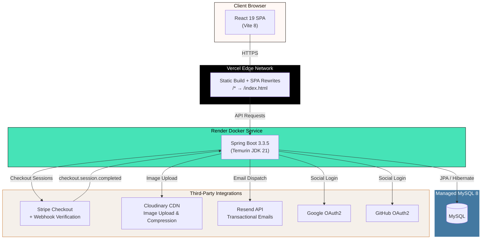
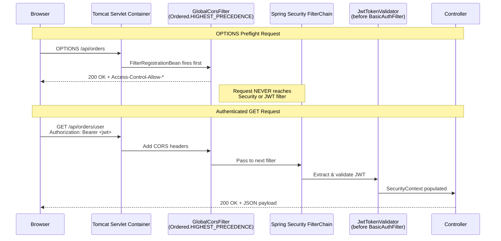
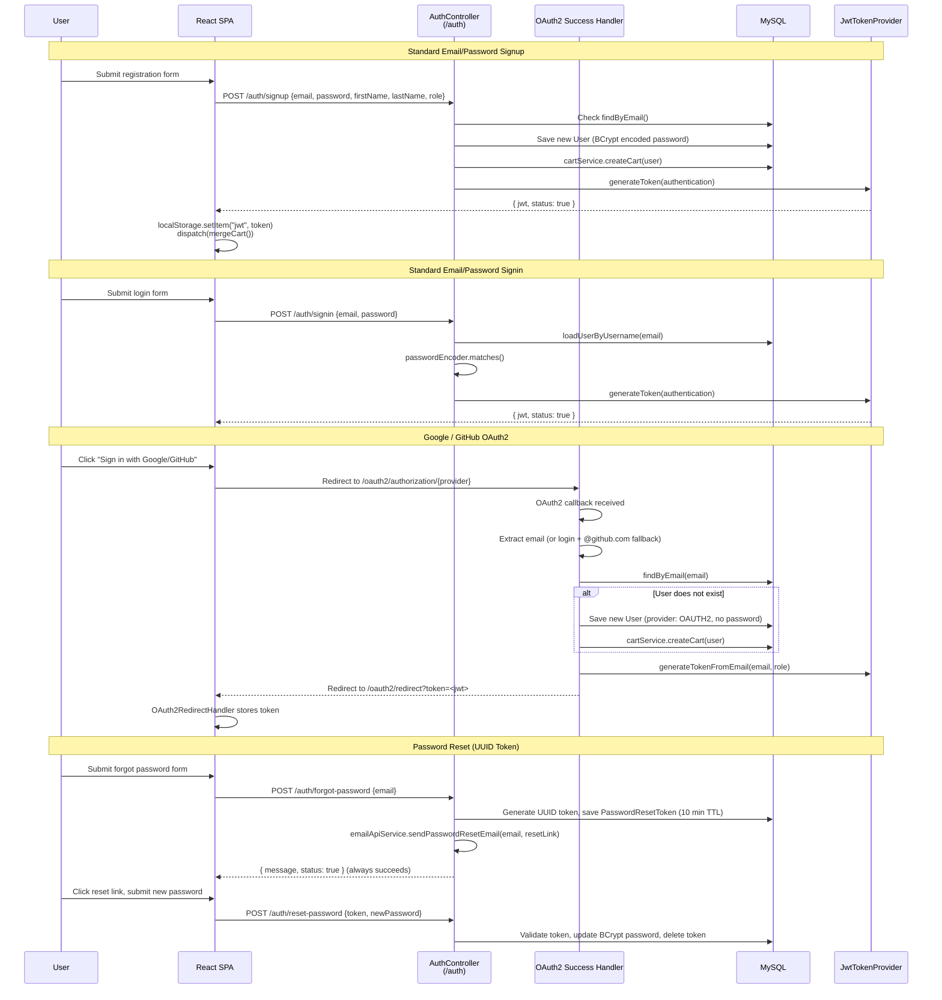
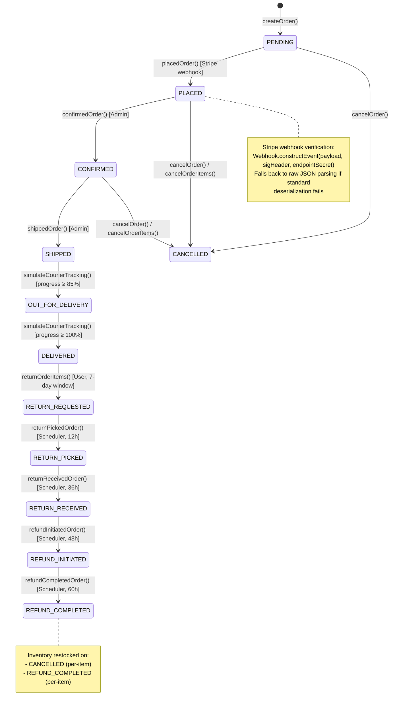
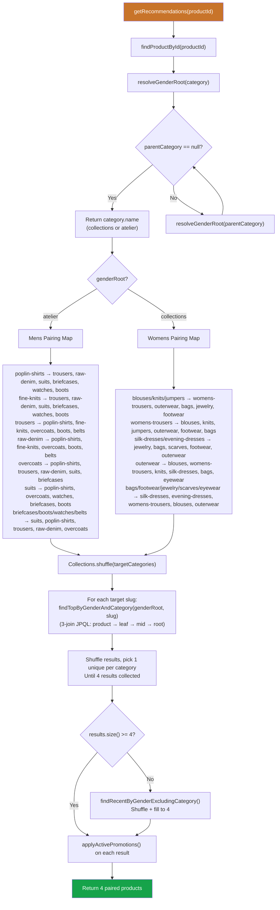
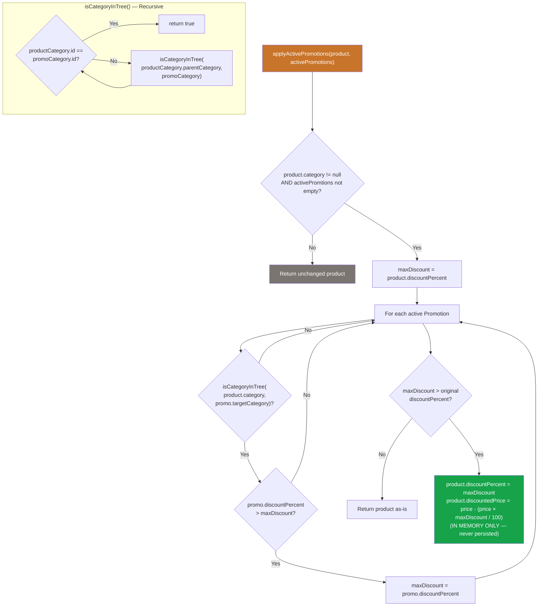
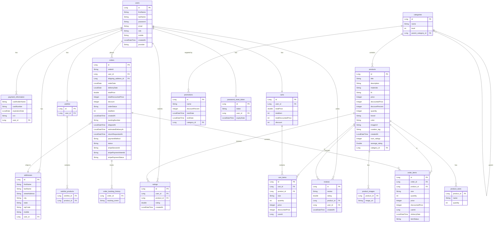

<div align="center">

# CLOTHSY

**Seasonless. Considered. Full-Stack E-Commerce.**

[](https://spring.io/projects/spring-boot)
[](https://react.dev)
[](https://redux-toolkit.js.org)
[](https://vitejs.dev)
[](https://stripe.com)
[](https://www.mysql.com)
[](https://openjdk.org)
[](https://tailwindcss.com)
[](https://mui.com)

[**Live Demo**](https://clothsy-seven.vercel.app/) · [**API Base**](https://clothsy-api.onrender.com) · [**GitHub**](https://github.com/harshadunna/Clothsy)

> ⚠️ **Note on Live Demo:** The Spring Boot backend is hosted on a free Render instance. If it has been inactive, the very first request may take **40-50 seconds** to wake the server up. Subsequent requests will be lightning fast.

</div>
---

## Overview

Clothsy is a production-deployed, full-stack luxury fashion e-commerce platform built with a Spring Boot 3.3.5 REST API and a React 19 SPA. The system ships with:

- **Dual-layer CORS architecture** — a `FilterRegistrationBean<CorsFilter>` at `Ordered.HIGHEST_PRECEDENCE` (Tomcat servlet level) handles preflight `OPTIONS` before Spring Security's `JwtTokenValidator` ever fires
- **OAuth2 social login** (Google + GitHub) with an automatic email/login fallback for users with hidden GitHub emails, plus a UUID-based password reset flow via Resend transactional emails
- **"Complete the Look" AI pairing engine** — gender-resolved outfit recommendations using recursive category tree traversal, hand-curated pairing maps, a three-join JPQL query, and randomized selection with fallback
- **Dynamic pricing engine** — `applyActivePromotions()` walks the category hierarchy at query time, applies the best active `Promotion` discount in memory, never persists promotional prices to the database
- **12-state order lifecycle** with item-level granularity (partial cancel, partial return), a `@Scheduled` courier tracking simulator for both forward and reverse logistics, and status-driven transactional email dispatch via the Resend API
- **Server-side PDF invoice generation** with OpenPDF, attached to order confirmation emails as Base64-encoded Resend attachments
- **Fuzzy search** with Levenshtein distance scoring and stop-word filtering across product title, description, brand, color, and category
- **Guest cart persistence** in `localStorage` with automatic merge on login via `POST /api/cart/merge`
- **Admin analytics dashboard** with time-windowed KPIs (weekly/monthly/yearly), category revenue breakdown, top products, low stock alerts, pending directives, and Recharts-powered revenue trend charts
- **Cloudinary image pipeline** for admin product uploads with `q_auto,f_auto` compression applied across the frontend

---

## System Architecture



---

## CORS & Security Filter Architecture

The CORS strategy intentionally disables Spring Security's built-in CORS support (`.cors(AbstractHttpConfigurer::disable)`) and registers a standalone Tomcat-level `CorsFilter` at `Ordered.HIGHEST_PRECEDENCE`. This guarantees that `OPTIONS` preflight requests are fully resolved and responded to before the request ever reaches the Spring Security filter chain where `JwtTokenValidator` sits.



**Key design decisions:**
- `FilterRegistrationBean<CorsFilter>` bean in `AppConfig` with `bean.setOrder(Ordered.HIGHEST_PRECEDENCE)`
- `JwtTokenValidator` extends `OncePerRequestFilter`, registered via `.addFilterBefore(new JwtTokenValidator(jwtSecret), BasicAuthenticationFilter.class)`
- JWT validation failures clear `SecurityContext` silently instead of throwing — prevents 500 errors on public endpoints with stale tokens
- Allowed origins include `safeFrontendUrl` (env-driven), `localhost:5173`, and `https://*.vercel.app` wildcard patterns

---

## Authentication & OAuth2 Flow



---

## Order Lifecycle State Diagram



**Stripe Webhook Verification Sequence:**
1. `POST /api/payments/webhook` receives raw payload + `Stripe-Signature` header
2. `Webhook.constructEvent()` verifies HMAC signature against `stripe.webhook.secret`
3. On `checkout.session.completed`, extracts `order_id` from session metadata
4. Falls back to raw JSON parsing via Jackson `ObjectMapper` if standard Stripe deserialization returns empty
5. Calls `orderService.placedOrder(orderId)` — deducts inventory, sets payment status to `COMPLETED`
6. Fires `emailApiService.sendOrderUpdateEmail(confirmedOrder, "PLACED")` with attached PDF invoice

---

## Complete the Look — Pairing Engine



**Three-Join JPQL Query:**
```sql
SELECT p FROM Product p
JOIN p.category c           -- leaf (level 3)
JOIN c.parentCategory mid   -- mid  (level 2)
JOIN mid.parentCategory root -- root (level 1)
WHERE LOWER(root.name) = LOWER(:genderRoot)
AND LOWER(c.name) = LOWER(:categorySlug)
ORDER BY p.createdAt DESC
```

---

## Dynamic Pricing Engine



**How it works at query time:**
1. `PromotionRepository.findActivePromotions(LocalDateTime.now())` fetches all promotions where `startDate <= now AND endDate >= now`
2. For every product returned from any query (paginated listing, search, product detail, recommendations), `applyActivePromotions()` is called
3. The engine walks up the product's category tree (`leaf → mid → root`) checking if any ancestor matches a promotion's `targetCategory`
4. The best discount (highest `discountPercent`) wins — applied **in memory only**, never saved to the database
5. This means promotional pricing is instantly live and automatically expires without any cron job or database migration

---

## Frontend Redux State Architecture

```mermaid
graph TB
    subgraph Store["Redux Store (configureStore)"]
        Auth["auth<br/>─────────────<br/>user: User | null<br/>jwt: string | null<br/>isLoading: boolean<br/>error: string | null<br/>customers: User[]<br/>fetchingUser: boolean"]
        
        Product["product / customersProduct<br/>─────────────<br/>products: Product[]<br/>product: Product | null<br/>loading: boolean<br/>error: string | null<br/>searchProducts: Product[]"]
        
        Cart["cart<br/>─────────────<br/>cart: Cart | null<br/>cartItems: CartItem[]<br/>loading: boolean<br/>error: string | null<br/>(initialized from localStorage)"]
        
        OrderSlice["order<br/>─────────────<br/>orders: Order[]<br/>order: Order | null<br/>loading: boolean<br/>error: string | null<br/>success: boolean"]
        
        Wishlist["wishlist<br/>─────────────<br/>wishlist: Wishlist | null<br/>loading: boolean<br/>error: string | null"]
        
        Review["review<br/>─────────────<br/>reviews: Review[]<br/>loading: boolean<br/>error: string | null"]
    end

    subgraph Interceptor["Axios Interceptor (api.js)"]
        Token["Dual-Token Selection:<br/>pathname.startsWith('/admin')<br/>→ localStorage.admin_jwt<br/>else → localStorage.jwt"]
    end

    subgraph Pages["Pages & Components"]
        Nav["Navigation"] -->|auth| Auth
        Home["HomePage"] -->|product| Product
        PDP["ProductDetails"] -->|product, review| Product
        PDP -->|product, review| Review
        CartPage["Cart"] -->|cart| Cart
        Checkout["Checkout"] -->|auth, cart| Auth
        Checkout -->|auth, cart| Cart
        Orders["Profile/Orders"] -->|auth, order| Auth
        Orders -->|auth, order| OrderSlice
        WishPage["Wishlist"] -->|wishlist| Wishlist
        AdminDash["AdminDashboard"] -->|auth| Auth
        AdminOrders["AdminOrders"] -->|auth| Auth
        AdminProducts["AdminProducts"] -->|product| Product
        AdminCustomers["AdminCustomers"] -->|auth.customers| Auth
    end

    Token -.->|Bearer header| Store

    style Store fill:#F5F0EA,stroke:#C8742A,color:#1A1109
    style Interceptor fill:#1A1109,stroke:#C8742A,color:#FFF8F5
    style Pages fill:#FFF8F5,stroke:#1A1109,color:#1A1109
```



**Dual-Token Interceptor Logic:**
```javascript
api.interceptors.request.use((config) => {
  const isAdminRoute = window.location.pathname.startsWith('/admin');
  const token = isAdminRoute
    ? localStorage.getItem("admin_jwt")
    : localStorage.getItem("jwt");
  if (token && token !== "null") {
    config.headers.Authorization = `Bearer ${token}`;
  }
  return config;
});
```

On `getUser()` success, if the authenticated user has role `ADMIN` or `ROLE_ADMIN`, the token is duplicated to `localStorage.admin_jwt`. On logout, only the context-appropriate token is removed (admin route clears `admin_jwt`, storefront clears `jwt`).

---

## Three-Level Category Hierarchy

```mermaid
graph TB
    Root["Category Hierarchy<br/>(3 levels)"]
    
    Root --> Women["collections<br/>(Level 1)"]
    Root --> Men["atelier<br/>(Level 1)"]
    
    Women --> WClothing["women_clothing<br/>(Level 2)"]
    Women --> WAccessories["women_accessories<br/>(Level 2)"]
    
    WClothing --> blouses["blouses"]
    WClothing --> knits["knits"]
    WClothing --> jumpers["jumpers"]
    WClothing --> womensTrousers["womens-trousers"]
    WClothing --> silkDresses["silk-dresses"]
    WClothing --> eveningDresses["evening-dresses"]
    WClothing --> outerwear["outerwear"]
    
    WAccessories --> bags["bags"]
    WAccessories --> footwear["footwear"]
    WAccessories --> jewelry["jewelry"]
    WAccessories --> scarves["scarves"]
    WAccessories --> eyewear["eyewear"]
    
    Men --> MClothing["men_clothing<br/>(Level 2)"]
    Men --> MAccessories["men_accessories<br/>(Level 2)"]
    
    MClothing --> poplinShirts["poplin-shirts"]
    MClothing --> fineKnits["fine-knits"]
    MClothing --> trousers["trousers"]
    MClothing --> rawDenim["raw-denim"]
    MClothing --> overcoats["overcoats"]
    MClothing --> suits["suits"]
    
    MAccessories --> briefcases["briefcases"]
    MAccessories --> boots["boots"]
    MAccessories --> watches["watches"]
    MAccessories --> belts["belts"]

    style Root fill:#1A1109,color:#FFF8F5
    style Women fill:#C8742A,color:#fff
    style Men fill:#C8742A,color:#fff
    style WClothing fill:#F5F0EA,stroke:#C8742A,color:#1A1109
    style WAccessories fill:#F5F0EA,stroke:#C8742A,color:#1A1109
    style MClothing fill:#F5F0EA,stroke:#C8742A,color:#1A1109
    style MAccessories fill:#F5F0EA,stroke:#C8742A,color:#1A1109
```



Categories are auto-created by `ProductServiceImplementation.createProduct()` via a three-level cascade: `topLevelCategory` → `secondLevelCategory` → `thirdLevelCategory`. The `resolveGenderRoot()` function recursively walks up to the Level 1 root to determine gender context for the pairing engine.

---

## Database ER Diagram



---

## Complete API Reference

### Authentication (`/auth`)

| Method | Endpoint | Auth | Description |
|--------|----------|------|-------------|
| `POST` | `/auth/signup` | Public | Register new user (BCrypt password, auto-creates cart) |
| `POST` | `/auth/signin` | Public | Authenticate and receive JWT token |
| `POST` | `/auth/forgot-password` | Public | Initiate password reset (UUID token, 10-min TTL, Resend email) |
| `POST` | `/auth/reset-password` | Public | Validate reset token and update password |

### Products (`/api/products`)

| Method | Endpoint | Auth | Description |
|--------|----------|------|-------------|
| `GET` | `/api/products` | Public | Paginated product listing with filters (category, color, size, price range, discount, sort, stock, search) |
| `GET` | `/api/products/id/{productId}` | Public | Get single product by ID (with reviews and dynamic pricing) |
| `GET` | `/api/products/search?q=` | Public | Full-text fuzzy search with Levenshtein distance |
| `GET` | `/api/products/{productId}/recommendations` | Public | "Complete the Look" gender-aware outfit pairings (4 products) |
| `GET` | `/api/products/{productId}/similar` | Public | Similar products by category (4 products) |
| `GET` | `/api/products/curations/{tag}` | Public | Curated editorial collections with multi-tier fallback |

### Cart (`/api/cart`)

| Method | Endpoint | Auth | Description |
|--------|----------|------|-------------|
| `GET` | `/api/cart/` | JWT | Get authenticated user's cart |
| `PUT` | `/api/cart/add` | JWT | Add item to cart |
| `POST` | `/api/cart/merge` | JWT | Merge guest localStorage cart into DB cart on login |
| `DELETE` | `/api/cart/clear` | JWT | Clear all items from cart |

### Cart Items (`/api/cart_items`)

| Method | Endpoint | Auth | Description |
|--------|----------|------|-------------|
| `DELETE` | `/api/cart_items/{cartItemId}` | JWT | Remove specific item from cart |
| `PUT` | `/api/cart_items/{cartItemId}` | JWT | Update cart item quantity or size |

### Orders (`/api/orders`)

| Method | Endpoint | Auth | Description |
|--------|----------|------|-------------|
| `POST` | `/api/orders` | JWT | Create order from cart with shipping address ID |
| `GET` | `/api/orders/user` | JWT | Get user's full order history (excludes PENDING) |
| `GET` | `/api/orders/{orderId}` | JWT | Get specific order by ID (JOIN FETCH items + products) |
| `PUT` | `/api/orders/{orderId}/cancel-items` | JWT | Partially cancel specific items (restocks inventory) |
| `PUT` | `/api/orders/{orderId}/return-items` | JWT | Request return for delivered items (7-day window) |

### Payments (`/api/payments`)

| Method | Endpoint | Auth | Description |
|--------|----------|------|-------------|
| `POST` | `/api/payments/{orderId}` | JWT | Create Stripe Checkout session (INR, order metadata) |
| `POST` | `/api/payments/webhook` | Public | Stripe webhook handler (signature verification, order placement) |

### Users (`/api/users`)

| Method | Endpoint | Auth | Description |
|--------|----------|------|-------------|
| `GET` | `/api/users/profile` | JWT | Get authenticated user profile |
| `POST` | `/api/users/addresses` | JWT | Save a new address for the user |

### Addresses (`/api/addresses`)

| Method | Endpoint | Auth | Description |
|--------|----------|------|-------------|
| `DELETE` | `/api/addresses/{addressId}` | JWT | Soft-delete address (sets user to null, preserves for old orders) |
| `PUT` | `/api/addresses/{addressId}` | JWT | Update an existing address |

### Wishlist (`/api/wishlist`)

| Method | Endpoint | Auth | Description |
|--------|----------|------|-------------|
| `GET` | `/api/wishlist` | JWT | Get user's wishlist |
| `PUT` | `/api/wishlist/toggle/{productId}` | JWT | Toggle product in/out of wishlist |

### Ratings (`/api/ratings`)

| Method | Endpoint | Auth | Description |
|--------|----------|------|-------------|
| `POST` | `/api/ratings/create` | JWT | Submit a rating for a product |
| `GET` | `/api/ratings/product/{productId}` | Public | Get all ratings for a product |

### Reviews (`/api/reviews`)

| Method | Endpoint | Auth | Description |
|--------|----------|------|-------------|
| `POST` | `/api/reviews/create` | JWT | Submit a review for a product |
| `GET` | `/api/reviews/product/{productId}` | Public | Get all reviews for a product |

### Admin — Products (`/api/admin/products`)

| Method | Endpoint | Auth | Description |
|--------|----------|------|-------------|
| `POST` | `/api/admin/products/` | ADMIN | Create product (multipart: JSON req + image file → Cloudinary) |
| `POST` | `/api/admin/products/creates` | ADMIN | Bulk create products (JSON array) |
| `GET` | `/api/admin/products/all` | ADMIN | List all products (unfiltered) |
| `PUT` | `/api/admin/products/{productId}/update` | ADMIN | Update product details |
| `DELETE` | `/api/admin/products/{productId}/delete` | ADMIN | Delete product |

### Admin — Orders (`/api/admin/orders`)

| Method | Endpoint | Auth | Description |
|--------|----------|------|-------------|
| `GET` | `/api/admin/orders` | ADMIN | List all orders (sorted by createdAt DESC) |
| `PUT` | `/api/admin/orders/{orderId}/confirmed` | ADMIN | Mark order as CONFIRMED |
| `PUT` | `/api/admin/orders/{orderId}/ship` | ADMIN | Mark order as SHIPPED (generates tracking number + ETA) |
| `PUT` | `/api/admin/orders/{orderId}/deliver` | ADMIN | Mark order as DELIVERED |
| `PUT` | `/api/admin/orders/{orderId}/cancel` | ADMIN | Cancel entire order (restocks all items) |
| `PUT` | `/api/admin/orders/{orderId}/return-picked` | ADMIN | Mark return items as picked up |
| `PUT` | `/api/admin/orders/{orderId}/return-received` | ADMIN | Mark return items as received at warehouse |
| `PUT` | `/api/admin/orders/{orderId}/refund-initiated` | ADMIN | Initiate refund process |
| `PUT` | `/api/admin/orders/{orderId}/refund-completed` | ADMIN | Complete refund (restocks inventory, sends email) |
| `DELETE` | `/api/admin/orders/{orderId}/delete` | ADMIN | Hard delete order |

### Admin — Users (`/api/admin`)

| Method | Endpoint | Auth | Description |
|--------|----------|------|-------------|
| `GET` | `/api/admin/users` | ADMIN | List all registered users |
| `PUT` | `/api/admin/users/{userId}/role` | ADMIN | Update user role (promote/demote) |
| `GET` | `/api/admin/users/export` | ADMIN | Export all users as CSV download |

### Admin — Promotions (`/api/admin/promotions`)

| Method | Endpoint | Auth | Description |
|--------|----------|------|-------------|
| `POST` | `/api/admin/promotions/?categoryId=` | ADMIN | Create time-bound promotion for a category |
| `GET` | `/api/admin/promotions/` | ADMIN | List all promotions |
| `DELETE` | `/api/admin/promotions/{promoId}` | ADMIN | Delete promotion |
| `GET` | `/api/admin/promotions/categories` | ADMIN | List all categories (for promotion targeting) |

### Admin — Analytics (`/api/admin/analytics`)

| Method | Endpoint | Auth | Description |
|--------|----------|------|-------------|
| `GET` | `/api/admin/analytics/dashboard?timeframe=` | ADMIN | Dashboard KPIs (revenue, orders, AOV, return rate, status distribution, top products, category revenue, low stock, pending orders, recent transactions) |
| `GET` | `/api/admin/analytics/charts` | ADMIN | Revenue trend data (weekly by day, monthly by week, yearly by month) |

### Health Check

| Method | Endpoint | Auth | Description |
|--------|----------|------|-------------|
| `GET` | `/` | Public | API health check — returns welcome message |

---

## Project Directory Tree

```
Clothsy/
├── Backend/
│   ├── Dockerfile                              # Multi-stage: Temurin JDK 21, mvnw build, JAR execution
│   ├── pom.xml                                 # Spring Boot 3.3.5 parent, all dependency versions
│   └── src/main/
│       ├── resources/
│       │   └── application.properties          # Env-var-driven config (DB, Stripe, OAuth2, Cloudinary, Resend)
│       └── java/org/harsha/backend/
│           ├── BackendApplication.java         # @EnableScheduling, PageSerializationMode.VIA_DTO
│           ├── config/
│           │   ├── AppConfig.java              # SecurityFilterChain + FilterRegistrationBean<CorsFilter> + OAuth2 handler
│           │   ├── CloudinaryConfig.java       # Cloudinary bean from env vars
│           │   ├── JwtConstant.java            # JWT_HEADER = "Authorization"
│           │   ├── JwtTokenProvider.java       # Token generation (24h TTL) + email extraction
│           │   └── JwtTokenValidator.java      # OncePerRequestFilter, silent failure on bad tokens
│           ├── controller/
│           │   ├── AuthController.java         # /auth — signup, signin, forgot-password, reset-password
│           │   ├── UserController.java         # /api/users — profile, address creation
│           │   ├── UserProductController.java  # /api/products — public listing, search, recommendations, curations
│           │   ├── CartController.java         # /api/cart — get, add, merge, clear
│           │   ├── CartItemController.java     # /api/cart_items — update, remove
│           │   ├── OrderController.java        # /api/orders — create, history, cancel-items, return-items
│           │   ├── PaymentController.java      # /api/payments — Stripe checkout + webhook
│           │   ├── AddressController.java      # /api/addresses — soft-delete, update
│           │   ├── WishlistController.java     # /api/wishlist — get, toggle
│           │   ├── RatingController.java       # /api/ratings — create, get by product
│           │   ├── ReviewController.java       # /api/reviews — create, get by product
│           │   ├── AdminProductController.java # /api/admin/products — CRUD + Cloudinary upload
│           │   ├── AdminOrderController.java   # /api/admin/orders — full lifecycle management
│           │   ├── AdminUserController.java    # /api/admin — user list, role update, CSV export
│           │   ├── AdminPromotionController.java # /api/admin/promotions — CRUD
│           │   ├── AdminAnalyticsController.java # /api/admin/analytics — KPIs + charts
│           │   └── HomeController.java         # / — health check
│           ├── model/
│           │   ├── User.java                   # Users table + addresses, ratings, reviews, paymentInfo
│           │   ├── Product.java                # Products table + sizes, images, ratings, reviews, category
│           │   ├── Category.java               # Self-referencing 3-level hierarchy with indexed name
│           │   ├── Order.java                  # Orders table + embedded PaymentDetails, tracking history
│           │   ├── OrderItem.java              # Per-item status tracking with delivery date
│           │   ├── Cart.java                   # 1:1 with User, totals calculated on access
│           │   ├── CartItem.java               # Cart item with product, size, quantity, prices
│           │   ├── Address.java                # Soft-deletable addresses (user set to null)
│           │   ├── Wishlist.java               # ManyToMany with Products
│           │   ├── Rating.java                 # Numeric rating per user per product
│           │   ├── Review.java                 # Text review + star rating
│           │   ├── Size.java                   # Embeddable: name + quantity per size
│           │   ├── Promotion.java              # Time-bound discount targeting a category
│           │   ├── PaymentDetails.java         # Embedded: Stripe session/intent IDs + status
│           │   ├── PaymentInformation.java     # Embedded: demo card details (non-PCI)
│           │   └── PasswordResetToken.java     # UUID token with 10-minute TTL
│           ├── repository/
│           │   ├── ProductRepository.java      # filterProducts(), 3-join gender queries, curation fallbacks
│           │   ├── OrderRepository.java        # JOIN FETCH queries, tracking status filters, analytics
│           │   ├── CategoryRepository.java     # findByName(), findByNameAndParent()
│           │   ├── OrderItemRepository.java    # findFrequentlyBoughtTogether() co-purchase query
│           │   ├── PromotionRepository.java    # findActivePromotions() by date range
│           │   ├── UserRepository.java         # findByEmail()
│           │   ├── CartRepository.java         # findByUserId()
│           │   ├── CartItemRepository.java     # User-scoped item queries
│           │   ├── AddressRepository.java      # findByUserId()
│           │   ├── WishlistRepository.java     # findByUserId()
│           │   ├── RatingRepository.java       # Product-scoped rating queries
│           │   ├── ReviewRepository.java       # Product-scoped review queries
│           │   └── PasswordResetTokenRepository.java # findByToken(), deleteByUserId()
│           ├── service/
│           │   ├── ProductServiceImplementation.java  # Pairing engine, dynamic pricing, fuzzy search
│           │   ├── OrderServiceImplementation.java    # 12-state lifecycle + @Scheduled courier sim
│           │   ├── CartServiceImplementation.java     # Cart operations with price recalculation
│           │   ├── EmailApiService.java               # Resend API + OpenPDF invoice generation
│           │   ├── CloudinaryService.java             # Image upload to Cloudinary
│           │   ├── CustomerUserDetails.java           # UserDetailsService for Spring Security
│           │   ├── DataInitializationComponent.java   # CommandLineRunner: seeds default admin
│           │   └── ... (interfaces + other implementations)
│           ├── request/                        # DTOs: AddItemRequest, CreateProductRequest, LoginRequest, etc.
│           ├── response/                       # DTOs: AuthResponse, ApiResponse
│           └── exception/                      # GlobalException handler + domain exceptions
│
└── Frontend/
    ├── vercel.json                             # SPA rewrite: /* → /index.html
    ├── package.json                            # React 19, Vite 8, MUI 7, Redux Toolkit 2.11
    └── src/
        ├── main.jsx                            # BrowserRouter + Provider + StrictMode
        ├── App.jsx                             # Top-level route split: /admin/* vs /*
        ├── ErrorBoundary.jsx                   # React error boundary wrapper
        ├── config/
        │   └── api.js                          # Axios instance + dual-token interceptor
        ├── Redux/
        │   ├── store.js                        # 6 slices: auth, product, customersProduct, cart, order, wishlist, review
        │   ├── Auth/
        │   │   ├── Action.js                   # register, login, getUser, logout, socialLoginSuccess, address CRUD
        │   │   ├── ActionTypes.js              # All auth action type constants
        │   │   └── Reducer.js                  # Auth state with address management
        │   └── Customers/
        │       ├── Product/                    # Product CRUD, search, find by ID/category
        │       ├── Cart/                       # Add, remove, update, get, merge, clear (localStorage init)
        │       ├── Order/                      # Create, get by ID, order history
        │       ├── Wishlist/                   # Get, toggle
        │       └── Review/                     # Create, get all by product
        ├── Routers/
        │   └── CustomerRoutes.jsx              # 25+ routes with Framer Motion page transitions
        ├── Admin/
        │   ├── AdminRoutes.jsx                 # 8 admin routes with role-gated access
        │   └── components/                     # Dashboard, Products, Orders, Customers, Promotions, Analytics
        └── customer/
            ├── components/
            │   ├── Navigation/                 # Responsive nav with search, cart, auth modals
            │   ├── Product/                    # Product grid with filters
            │   ├── ProductDetails/             # PDP with reviews, ratings, recommendations
            │   ├── Cart/                       # Shopping cart with guest persistence
            │   ├── Checkout/                   # Multi-step checkout with address management
            │   ├── Order/                      # OrderDetails, ReturnOrder, Invoice
            │   ├── Payment/                    # PaymentSuccess, PaymentCancel
            │   ├── Account/                    # Profile with orders and addresses
            │   ├── Auth/                       # OAuth2RedirectHandler
            │   └── Footer/                     # Site-wide footer
            └── pages/
                ├── HomePage.jsx                # Hero slideshow + editorial curations
                ├── Wishlist.jsx                # Wishlist grid
                ├── CurationPage.jsx            # Editorial product collections
                ├── Journal.jsx                 # Brand journal / editorial content
                ├── Returns.jsx                 # Return policy page
                ├── Track.jsx                   # Order tracking page
                ├── ResetPassword.jsx           # Password reset form
                ├── Contact.jsx                 # Contact page
                ├── About.jsx                   # Brand story / craftsmanship
                └── NotFound.jsx                # 404 page
```

---

## Tech Stack

### Backend

| Technology | Version | Purpose |
|------------|---------|---------|
| Java | 17 | Language runtime |
| Spring Boot | 3.3.5 | Application framework |
| Spring Security | (managed) | Authentication, authorization, OAuth2 |
| Spring Data JPA | (managed) | ORM and data access |
| Spring OAuth2 Client | (managed) | Google + GitHub social login |
| Spring Validation | (managed) | Request body validation |
| MySQL Connector/J | (managed) | Database driver |
| JJWT (jjwt-api/impl/jackson) | 0.12.6 | JWT token generation and validation |
| Stripe Java | 24.22.0 | Payment processing + webhook verification |
| Cloudinary HTTP44 | 1.36.0 | Image upload and CDN management |
| OpenPDF | 1.3.32 | Server-side PDF invoice generation |
| SpringDoc OpenAPI | 2.5.0 | API documentation (Swagger UI) |
| Lombok | 1.18.30 | Boilerplate reduction |
| Spring Dotenv | 4.0.0 | `.env` file support for local development |
| Eclipse Temurin | 21 (Docker) | Production JDK runtime |

### Frontend

| Technology | Version | Purpose |
|------------|---------|---------|
| React | 19.2.4 | UI library |
| React DOM | 19.2.4 | DOM rendering |
| React Router DOM | 7.13.1 | Client-side routing |
| Redux Toolkit | 2.11.2 | Global state management |
| React Redux | 9.2.0 | React-Redux bindings |
| Axios | 1.13.6 | HTTP client with interceptors |
| MUI Material | 7.3.9 | Component library |
| MUI Icons Material | 7.3.9 | Icon set |
| Emotion (react + styled) | 11.14.0 / 11.14.1 | CSS-in-JS for MUI |
| Headless UI | 2.2.9 | Unstyled accessible components |
| Heroicons | 2.2.0 | SVG icon library |
| Framer Motion | 12.38.0 | Page transitions and animations |
| GSAP | 3.14.2 | Advanced animations (hero slideshow) |
| Recharts | 3.8.1 | Admin analytics charts |
| React Alice Carousel | 2.9.1 | Product carousels |
| html2pdf.js | 0.14.0 | Client-side invoice PDF generation |
| Tailwind CSS | 3.4.19 | Utility-first CSS framework |
| Vite | 8.0.0 | Build tool and dev server |

---

## Local Development Setup

### Prerequisites

- Java 17+
- Node.js 18+
- MySQL 8.0+
- Maven (or use the included `mvnw` wrapper)

### 1. Clone the Repository

```bash
git clone https://github.com/harshadunna/Clothsy.git
cd Clothsy
```

### 2. MySQL Database Setup

```sql
CREATE DATABASE clothsy_db;
```

> On first run with `ddl-auto=update`, Hibernate will auto-create all tables. Production uses `ddl-auto=validate`.

### 3. Backend Setup

```bash
cd Backend

# Create .env file (spring-dotenv reads this automatically)
cp .env.example .env
# Fill in all environment variables (see table below)

# Run with Maven wrapper
./mvnw spring-boot:run
```

The backend starts on `http://localhost:8080`.  
A default admin account is seeded on first launch via the `DataInitializationComponent`.

### 4. Frontend Setup

```bash
cd Frontend

# Install dependencies
npm install

# Create .env file
echo "VITE_API_URL=http://localhost:8080" > .env

# Start dev server
npm run dev
```

The frontend starts on `http://localhost:5173`.

---

## Environment Variables

### Backend (`Backend/.env`)

| Variable | Description |
|----------|-------------|
| `FRONTEND_URL` | Frontend origin URL (e.g., `https://clothsy-seven.vercel.app`) |
| `BACKEND_URL` | Backend origin URL (e.g., `https://clothsy-api.onrender.com`) |
| `DB_URL` | MySQL JDBC URL (e.g., `jdbc:mysql://host:3306/clothsy_db`) |
| `DB_USERNAME` | MySQL username |
| `DB_PASSWORD` | MySQL password |
| `JWT_SECRET` | HMAC signing key for JWT tokens (min 32 chars) |
| `STRIPE_SECRET_KEY` | Stripe secret API key (`sk_...`) |
| `STRIPE_WEBHOOK_SECRET` | Stripe webhook endpoint secret (`whsec_...`) |
| `RESEND_API_KEY` | Resend API key for transactional email delivery |
| `GOOGLE_CLIENT_ID` | Google OAuth2 client ID |
| `GOOGLE_CLIENT_SECRET` | Google OAuth2 client secret |
| `GITHUB_CLIENT_ID` | GitHub OAuth2 client ID |
| `GITHUB_CLIENT_SECRET` | GitHub OAuth2 client secret |
| `CLOUDINARY_CLOUD_NAME` | Cloudinary cloud name |
| `CLOUDINARY_API_KEY` | Cloudinary API key |
| `CLOUDINARY_API_SECRET` | Cloudinary API secret |

### Frontend (`Frontend/.env`)

| Variable | Description |
|----------|-------------|
| `VITE_API_URL` | Backend API base URL (e.g., `https://clothsy-api.onrender.com`) |

---

## Deployment

### Frontend — Vercel

The frontend is deployed as a static Vite build on Vercel. The `vercel.json` configuration enables SPA client-side routing:

```json
{
  "rewrites": [
    {
      "source": "/(.*)",
      "destination": "/index.html"
    }
  ]
}
```

All routes (including `/admin/*`, `/:levelOne/:levelTwo/:levelThree`, `/account/order/:orderId`, etc.) are rewritten to `index.html`, allowing React Router to handle routing entirely on the client side.

**Build command:** `npm run build` (Vite production build)  
**Output directory:** `dist/`

### Backend — Render (Docker)

The backend is deployed on Render using a Docker-based build. The `Dockerfile`:

```dockerfile
FROM eclipse-temurin:21-jdk
WORKDIR /app
COPY . .
RUN chmod +x mvnw
RUN ./mvnw clean package -DskipTests
EXPOSE 8080
CMD java -jar target/*.jar
```

**Build process:**
1. Uses Eclipse Temurin JDK 21 as the base image
2. Copies the entire backend source into the container
3. Runs `mvnw clean package -DskipTests` to build the Spring Boot fat JAR
4. Exposes port 8080 (Render's default HTTP port)
5. Starts the application using the shell form of `CMD` with wildcard JAR resolution

**Environment variables** are configured through Render's dashboard and injected at runtime.

---

## License

Distributed under the **MIT License**. See `LICENSE` for more information.

---

## Contact

**Harsha Vardhan Dunna**

📧 [harshadunna27@gmail.com](mailto:harshadunna27@gmail.com)

🔗 [LinkedIn](https://www.linkedin.com/in/harsha-dunna)

💻 [GitHub](https://github.com/harshadunna)
